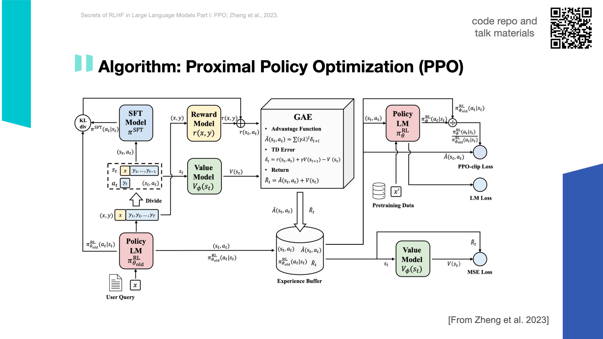
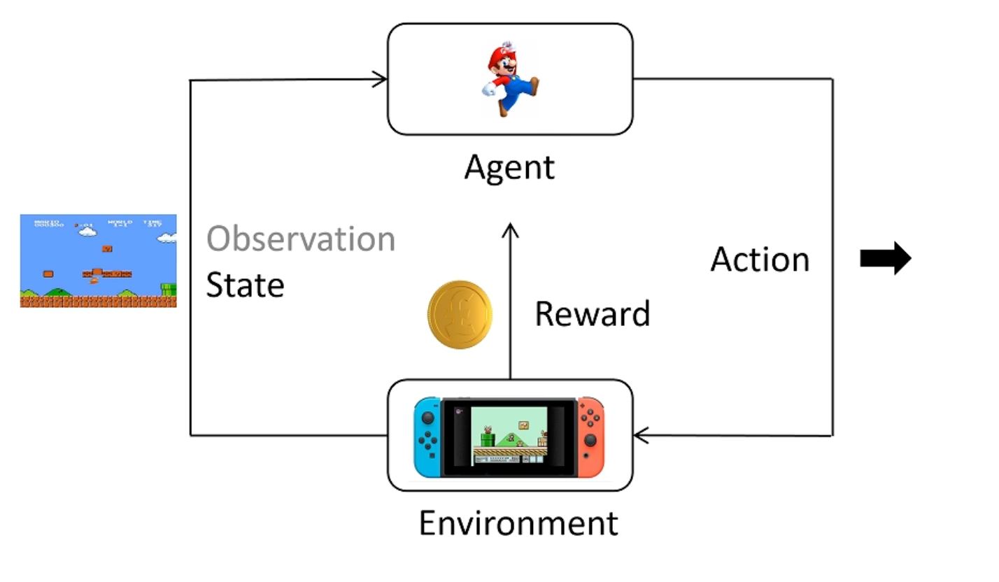

# PPO算法

## 整体流程
{: style="max-width: 100%; height: auto; display: block; margin: 0 auto;" }

## 强化学习
{: style="max-width: 100%; height: auto; display: block; margin: 0 auto;" }

### 一些基本概念
- __action space__：动作空间，即agent可以采取的动作的集合
- __state space__：状态空间，即agent可以观察到的状态的集合
- __policy__：策略，即agent在某个状态下采取某个动作的概率分布

$$\pi(a|s)$$

表示在状态$s$下，agent采取动作$a$的概率。这个策略一般是要学习的对象。

- __trajectory__：轨迹，即agent在环境中的一次交互序列

$$\tau = (s_0, a_0, s_1, a_1, \cdots)$$

其中$s_i$表示第$i$个状态，$a_i$表示第$i$个动作。

$$P(\tau) = P(s_0) \pi(a_0|s_0) P(s_1|s_0, a_0) \pi(a_1|s_1) \cdots$$

表示轨迹$\tau$的概率，其中$P(S_1|s_0, a_0)$表示在状态$s_0$下采取动作$a_0$后转移到状态$s_1$的概率，这种转移可以是确定性的，也可以是随机的。

- __reward__：奖励，即agent在某个状态下采取某个动作后得到的奖励

$$r(s, a)$$

表示在状态$s$下，agent采取动作$a$后得到的奖励。

- __return__：回报，对于一个轨迹$\tau$，其回报定义为

$$R(\tau) = \sum_{t=0}^{\infty} r(s_t, a_t)$$

即轨迹中所有奖励的和。

### 强化学习的目标
强化学习的目标是找到一个策略$\pi$，使得agent在环境中的return最大。这个return最大可以用两种方式来定义：

对于任意的状态$s$，$\pi$给出相应的动作$a$，使得agent的 _期望_ 回报最大

对于$\pi$生成的所有轨迹$\tau$，使得所有轨迹的 _期望_ 回报最大

假设$\theta$是策略$\pi$的参数，那么期望回报可以表示为

$$
\begin{aligned}
    &E(R(\tau))_{\tau \sim P_{\theta}(\tau)}\\
    =& \sum_{\tau} P_{\theta}(\tau) R(\tau)\\
\end{aligned}
$$ 

对他求导，可以得到
$$
\begin{aligned}
    &\nabla_{\theta} \sum_{\tau} P_{\theta}(\tau) R(\tau) \\
    =& \sum_{\tau} R(\tau) \nabla_{\theta} P_{\theta}(\tau)\\
    =& \sum_{\tau} R(\tau) P_{\theta}(\tau) \frac{\nabla_{\theta} P_{\theta}(\tau)}{P_{\theta}(\tau)}\\
    \approx& \frac{1}{N} \sum_{i=1}^{N} R(\tau_i) \frac{\nabla_{\theta} P_{\theta}(\tau_i)}{P_{\theta}(\tau_i)} \quad // \text{采样N个轨迹，用这N个轨迹的平均值来估计期望} \\
    =& \frac{1}{N} \sum_{i=1}^{N} R(\tau_i) \nabla_{\theta} \log P_{\theta}(\tau_i) \quad // \text{由于$\nabla_{\theta} \log P_{\theta}(\tau_i) = \frac{\nabla_{\theta} P_{\theta}(\tau_i)}{P_{\theta}(\tau_i)}$} \\
    =& \frac{1}{N} \sum_{i=1}^{N} R(\tau_i) \nabla_{\theta} \log\prod_{t=0}^{T} P_{\theta}(a_t|s_t)P(s_{t+1}|s_t, a_t) \quad // \text{轨迹$\tau_i$的概率$P_{\theta}(\tau_i)$可以展开} \\
    =& \frac{1}{N} \sum_{i=1}^{N} R(\tau_i) \nabla_{\theta} \log\prod_{t=0}^{T} P_{\theta}(a_t|s_t) \quad // \text{$P(s_{t+1}|s_t, a_t)$是环境的转移概率，与策略无关} \\
    =& \frac{1}{N} \sum_{i=1}^{N} R(\tau_i) \sum_{t=0}^{T} \nabla_{\theta} \log P_{\theta}(a_t|s_t) \quad // \text{对数代入} \\
\end{aligned}
$$

如此，我们就得到了一个可以用来更新策略参数$\theta$的梯度。

接下来，我们可以定义loss function为

$$
Loss = -\frac{1}{N} \sum_{i=1}^{N} R(\tau_i) \sum_{t=0}^{T} \log P_{\theta}(a_t|s_t)
$$

